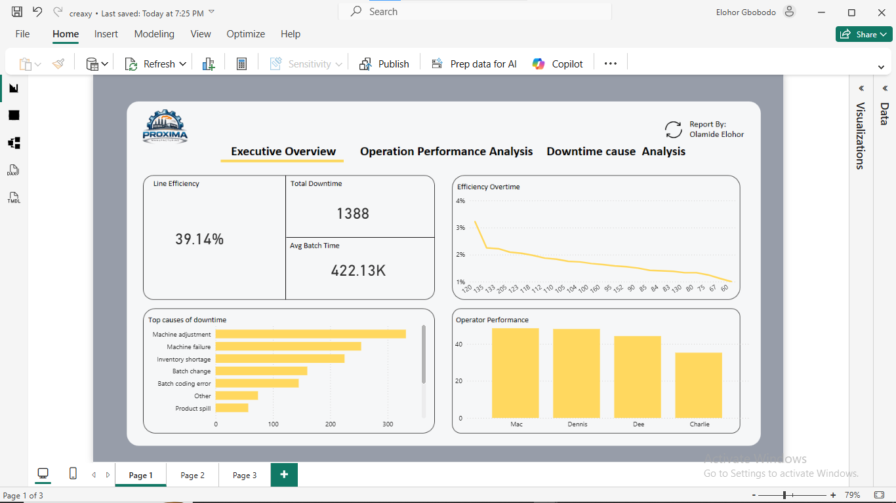
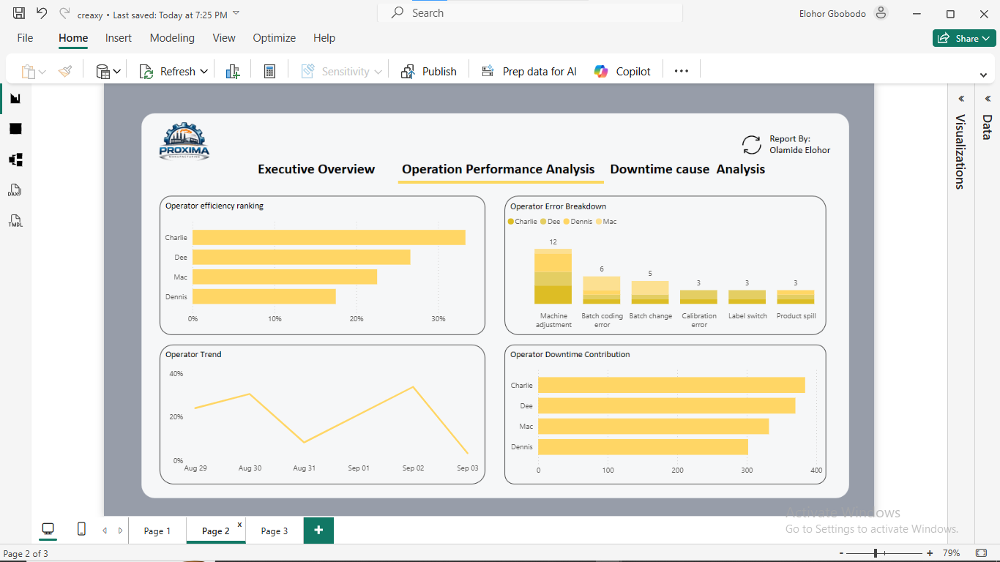
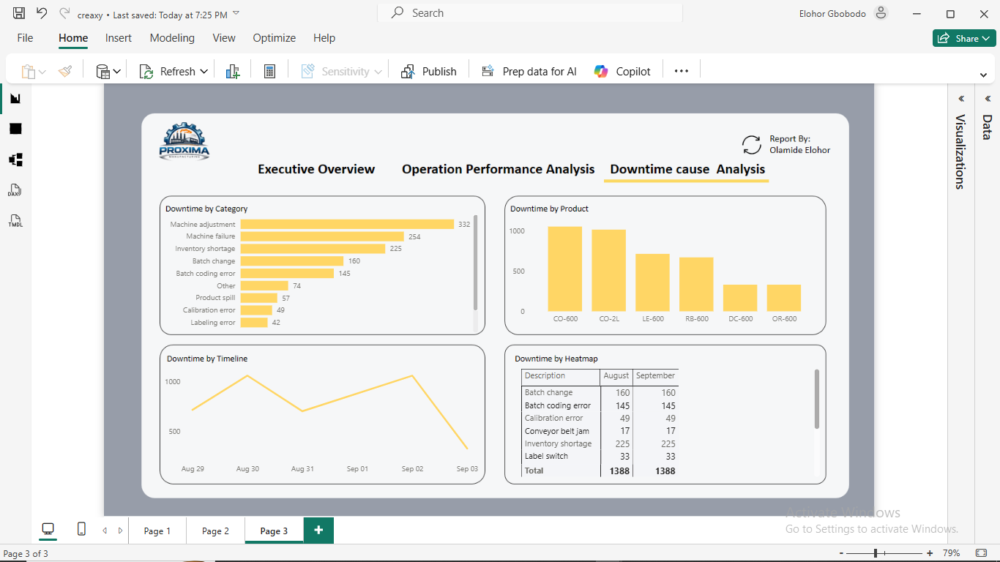

# Proxima-Manufacturing-
# 📊 Manufacturing Line Efficiency & Downtime Analysis

## 📌 Project Overview
This project analyzes **production line efficiency and downtime patterns** for a soda bottling operation. The goal is to identify:

- Overall line performance  
- Key drivers of downtime  
- Operator performance trends  
- Opportunities for operational improvement  

The dashboard was built using **Power BI**, leveraging multiple related tables including production logs, downtime records, and product metadata.

---

## 🎯 Business Problem
Manufacturing operations often suffer from inefficiencies due to:

- Machine-related issues  
- Operator errors  
- Poor process control  

This project answers key business questions:

- What is the current line efficiency?  
- Which operators are underperforming?  
- What are the main causes of downtime?  
- When do downtime events occur most frequently?  

---

## 🧩 Dataset Description
The dataset consists of multiple tables:

### **1. Line Productivity**
- Date, Product, Batch, Operator  
- Start Time, End Time  
- Production Duration  

### **2. Downtime Data**
- Batch-level downtime across multiple factors  
- Unpivoted into:
  - Downtime Factor  
  - Downtime Minutes  

### **3. Downtime Factors**
- Descriptions of each downtime category  
- Indicator for operator-related errors  

### **4. Products**
- Product type, size, and minimum batch time  

---

## 🛠️ Data Preparation
Key transformation steps:

- Unpivoted downtime columns into a normalized structure  
- Created relationships between:
  - Batch → Production & Downtime  
  - Factor → Downtime descriptions  
- Built calculated measures including:
  - Line Efficiency (%)  
  - Total Downtime  
  - Average Batch Time  

---

## 📈 Dashboard Structure

### 🟩 Page 1 — Executive Overview
Provides a high-level summary of performance:

- Line Efficiency  
- Total Downtime  
- Average Batch Time  
- Efficiency trend over time  
- Top causes of downtime  
- Operator performance comparison  

---

### 🟦 Page 2 — Operator Performance Analysis
Focuses on workforce performance:

- Operator efficiency ranking  
- Operator efficiency trend over time  
- Downtime contribution by operator  
- Operator-specific performance patterns  

---

### 🟥 Page 3 — Downtime Cause Analysis
Explores root causes of inefficiencies:

- Downtime by factor  
- Downtime trend over time  
- Heatmap of downtime (Factor vs Date)  
- Product-level downtime analysis  

---

## 🔍 Key Insights

### 1️⃣ Low Overall Efficiency
The production line operates at approximately **39% efficiency**, which is significantly below optimal manufacturing standards (**~80–90%**).  
This indicates major inefficiencies in the production process.

---

### 2️⃣ Machine Issues Are the Primary Bottleneck
**Machine adjustment and machine failure** are the leading contributors to downtime.  
These factors account for the largest share of lost production time.

---

### 3️⃣ Downtime Is Not Evenly Distributed
Certain days show **significant spikes in downtime**, indicating inconsistent operational stability.  
This suggests reactive rather than preventive maintenance.

---

### 4️⃣ Operator Performance Varies
Some operators consistently perform better than others.  
Lower-performing operators may be affected by:

- More complex batches  
- Higher exposure to downtime events  
- Skill or training gaps  

---

### 5️⃣ Product-Level Impact
Certain products are associated with **higher downtime**, likely due to:

- Setup complexity  
- Machine calibration requirements  

---

## 🚀 Recommendations

### 🔧 1. Improve Preventive Maintenance
- Address machine adjustment and failure issues  
- Implement scheduled maintenance to reduce unexpected downtime  

### 👨‍🏭 2. Standardize Operator Processes
- Identify best-performing operators  
- Replicate their workflows across the team  

### 📊 3. Monitor High-Risk Products
- Investigate products with high downtime  
- Optimize setup and production processes  

### 📅 4. Track Daily Performance Closely
- Use daily monitoring to quickly identify anomalies  
- Act on downtime spikes immediately  

### 📉 5. Set Performance Benchmarks
- Introduce target efficiency (e.g., 85%)  
- Track variance from target in real time  

---

## 🧠 Key Skills Demonstrated
- Data cleaning and transformation (**Power Query**)  
- Data modeling and relationships  
- DAX measure creation  
- Dashboard design and storytelling  
- Root cause analysis  
- Business insight generation  

---

## 📌 Tools Used
- Power BI  
- DAX (Data Analysis Expressions)  
- Power Query  

---

## 📷 Dashboard Preview
Executive Overview

### Operator Performance

### Downtime Analysis

